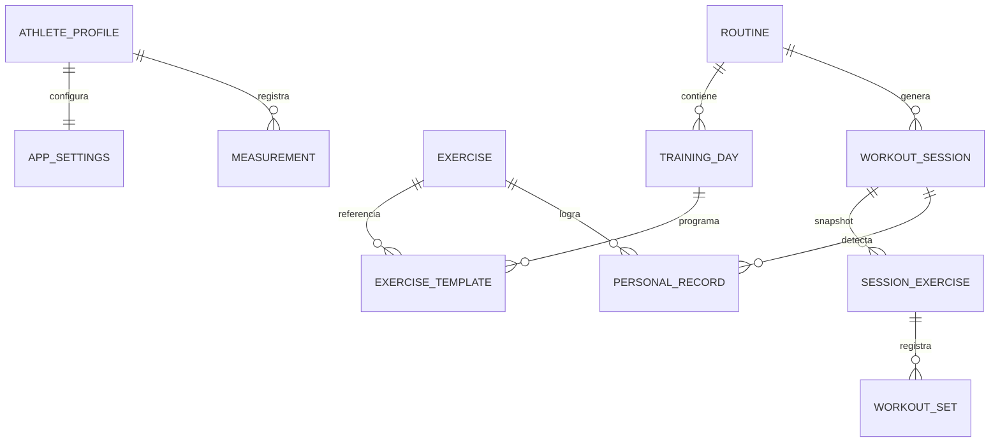
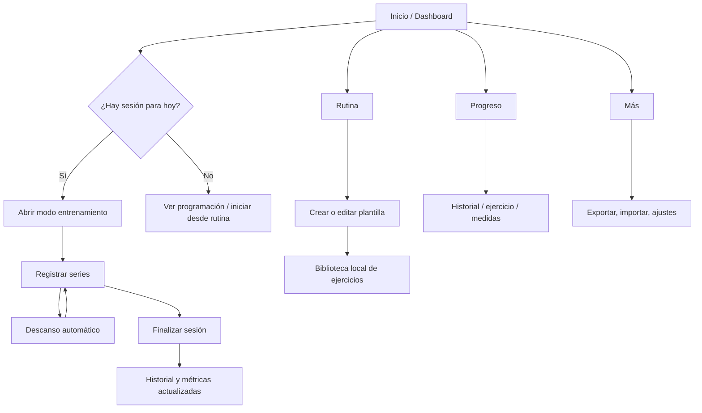

# Pulso Fit — Arquitectura offline-first

> **Propósito:** convertir el diario de entrenamiento en un sistema móvil local-first que separa la planificación de la ejecución y mantiene cada sesión histórica inmutable.

## 1. Decisiones de arquitectura

| Decisión | Implementación | Motivo |
|---|---|---|
| Plataforma | Expo SDK 54 + React Native + TypeScript | App nativa para iOS, Android y web desde una base común. |
| Navegación | Expo Router con cuatro tabs y rutas modales | Acceso rápido durante el entrenamiento y flujos completos sin callejones sin salida. |
| Persistencia | `AsyncStorage` con un documento JSON versionado | Equivalente local para React Native a IndexedDB/Dexie: no usa red, es portable y permite exportación directa. |
| Estado | React Context + `useReducer` | Actualizaciones predecibles, pocas dependencias y persistencia centralizada. |
| Analítica | Funciones puras derivadas de sesiones | No se duplican agregados críticos; los gráficos, PRs y volumen se recalculan desde datos reales. |
| Assets | Iconos vectoriales incluidos en Expo | Sin dependencias de CDN o Internet en tiempo de ejecución. |
| Sincronización | Interfaz de repositorio local preparada para extender | No se usa backend, cuenta ni autenticación; una futura sincronización puede consumir los snapshots locales. |

## 2. Modelo de dominio

```ts
AthleteProfile {
  id, name, birthDate?, height?, goal?, unit: 'kg' | 'lb',
  createdAt, updatedAt
}

Exercise {
  id, name, muscleGroups[], equipment, category,
  instructions?, notes?, isCustom
}

Routine {
  id, name, description?, goal, daysPerWeek, startDate,
  active, block?, mesocycle?, trainingDays[], createdAt, updatedAt
}

TrainingDay {
  id, name, weekday: 0..6, order, exercises: ExerciseTemplate[]
}

ExerciseTemplate {
  id, exerciseId, name, order, sets, repRangeMin, repRangeMax,
  targetWeight?, targetRir?, targetRpe?, restSeconds, tempo?, notes?, supersetGroup?
}

WorkoutSession {
  id, routineId, routineName, trainingDayId, trainingDayName,
  scheduledDate, startedAt?, completedAt?, status,
  block?, mesocycle?, microcycle?, exercises: SessionExercise[], notes?, recovery?
}

SessionExercise {
  id, templateId, exerciseId, name, order, target: ExerciseTarget,
  previousPerformance?: PreviousPerformance, sets: WorkoutSet[], notes?
}

WorkoutSet {
  id, order, weight, reps, rir?, rpe?, restSeconds, completedAt?, notes?
}

Measurement {
  id, date, weight?, bodyFat?, chest?, shoulders?, waist?, hips?,
  rightBicep?, leftBicep?, rightThigh?, leftThigh?, notes?, customMetrics?
}

PersonalRecord {
  id, exerciseId, exerciseName, date, weight, reps,
  type: 'weight' | 'estimated_1rm' | 'volume', sourceSessionId?
}

AppSettings {
  schemaVersion, theme, showRir, showRpe, prCelebration, firstRunCompleted
}
```

### Regla de inmutabilidad

`Routine` es una **plantilla editable**. Al abrir una sesión, la aplicación crea un `WorkoutSession` con un snapshot de sus ejercicios y objetivos. Editar o sustituir ejercicios en la rutina afecta sólo a sesiones futuras; las sesiones guardadas conservan exactamente la carga, repeticiones, RIR/RPE y nombre con que se realizaron.

## 3. Diagrama de relaciones



## 4. Almacenamiento local (equivalente a IndexedDB)

La app persiste un único objeto de respaldo en `AsyncStorage` bajo la clave `pulso-fit/database/v1`:

```json
{
  "schemaVersion": 1,
  "updatedAt": "2026-09-25T00:00:00.000Z",
  "profile": {},
  "settings": {},
  "exercises": [],
  "routines": [],
  "sessions": [],
  "measurements": [],
  "records": []
}
```

### Reglas de integridad

1. Cada entidad recibe un UUID local y timestamps ISO.
2. Validadores rechazan pesos negativos, repeticiones no positivas, RIR fuera de 0–5 y RPE fuera de 1–10.
3. Las acciones mutan el estado sólo mediante el repositorio/contexto; después se persiste una copia consistente.
4. La exportación contiene `schemaVersion`, `exportDate`, `appVersion` y el documento completo.
5. La importación analiza el JSON y solicita el modo: combinar, reemplazar o cancelar. Nunca sobrescribe por defecto.
6. La primera apertura permite cargar un ejemplo; ese ejemplo es local y se puede limpiar desde Ajustes.

## 5. Arquitectura de carpetas

```text
app/
  _layout.tsx                    # Providers globales
  (tabs)/
    _layout.tsx                  # Inicio, Rutina, Progreso, Más
    index.tsx                    # Dashboard y sesión de hoy
    routine.tsx                  # Rutina activa, ejercicios y edición rápida
    progress.tsx                 # Historial, métricas y medidas
    more.tsx                     # Biblioteca, backup y ajustes
  workout/[id].tsx               # Modo entrenamiento, sin tab bar
  exercise/[id].tsx              # Historial por ejercicio
  routine-builder.tsx            # Crear / editar una rutina
  measurements.tsx               # Registro de medidas
components/
  app/                           # Cards, botones, chips, inputs, gráficos SVG
context/
  fitness-context.tsx            # Estado, comandos y persistencia local
features/
  analytics.ts                   # Volumen, tendencias, PR y estancamiento
  session-generator.ts           # Plantilla -> snapshot de sesión
  export-import.ts               # Backup JSON y validación
  sample-data.ts                 # Rutina de ejemplo y biblioteca local
types/
  fitness.ts                     # Entidades y contratos
docs/
  architecture.md                # Diseño y decisiones de la app
```

## 6. Flujo de navegación



## 7. Especificación de pantallas

| Pantalla | Responsabilidad principal | Acciones clave |
|---|---|---|
| Inicio | Presenta el entrenamiento del día, métricas semanales y PRs recientes. | Iniciar/reanudar sesión, crear sesión, ir a rutina. |
| Rutina | Administra la plantilla activa y sus días. | Crear/duplicar/activar rutina, editar día, añadir ejercicios. |
| Constructor | Configura un día y sus ejercicios con objetivo. | Buscar biblioteca, series, repeticiones, carga, RIR/RPE, descanso y notas. |
| Modo entrenamiento | Registro de máxima velocidad y foco. | Ajustar peso/reps, completar serie, iniciar/saltar/añadir descanso, avanzar y finalizar. |
| Historial/Progreso | Explica evolución basada sólo en datos registrados. | Consultar sesiones, ejercicio, volumen, PRs y alerta de posible estancamiento. |
| Medidas | Registra y compara medidas corporales. | Añadir medición y visualizar tendencia de peso. |
| Más/Ajustes | Privacidad y portabilidad de datos. | Biblioteca, exportar, importar, tema, unidades, borrar datos con confirmación. |

## 8. Fases de implementación

1. **Base local:** tipos, ejemplo, repositorio `AsyncStorage`, provider y tema premium.
2. **Rutinas:** biblioteca, rutina activa, constructor de días y ejercicios, duplicación.
3. **Sesiones:** generador de snapshots, sesión de hoy, autocompletado previo, modo entrenamiento y cronómetro.
4. **Historial y análisis:** volumen, evolución por ejercicio, PR automático/manual, medidas y posible estancamiento.
5. **Portabilidad y calidad:** exportar/importar, validación, estados vacíos, pruebas de tipos y verificación visual.

## 9. Criterios de aceptación mapeados

- **Configuración una vez:** las plantillas contienen días y objetivos y se pueden editar sin corromper sesiones previas.
- **Entrenar rápido:** controles numéricos, valores anteriores, botones grandes y descanso automático.
- **Datos locales:** todos los comandos trabajan contra `AsyncStorage`; no se efectúan peticiones de red.
- **Historial fiable:** cada sesión es un snapshot completo; se puede abrir después y analizar por ejercicio.
- **Progreso útil:** volumen, tendencia de carga, PRs, medidas y señal de estancamiento sin afirmaciones médicas.
- **Backup portable:** JSON versionado, validado antes de reemplazar o combinar.
